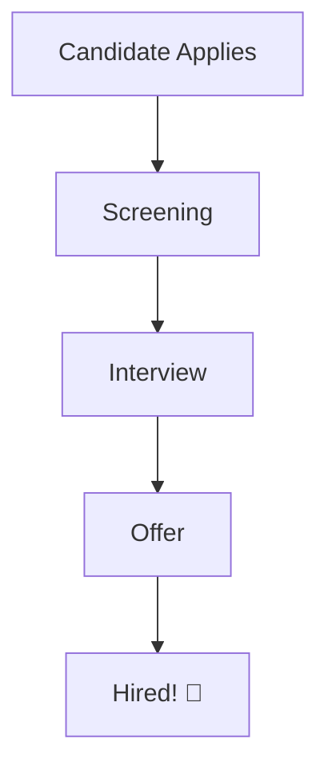
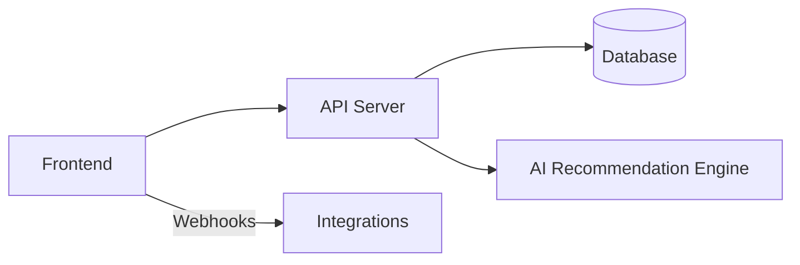

<!-- Badges -->
<p align="center">
  <a href="https://github.com/TejaswiVallabhaneni7/PrismHire/actions">
    
  </a>
  <a href="https://github.com/TejaswiVallabhaneni7/PrismHire/stargazers">
    
  </a>
  <a href="https://github.com/TejaswiVallabhaneni7/PrismHire/blob/main/LICENSE">
    
  </a>
</p>

<!-- Title and Tagline -->
<h1 align="center">🌈 PrismHire</h1>
<p align="center"><i>Your next generation hiring & recruitment platform, built for speed and simplicity.</i></p>

<!-- Animated Demo GIF -->
<p align="center">
  
</p>

<hr style="border-top: 8px solid #4f8cff; border-radius: 5px; width: 70%; margin: 40px auto;"/>

## ✨ Features

- 🚀 Lightning-fast candidate search and matching
- 🎨 Beautiful, intuitive UI
- 🤖 Smart recommendations powered by AI
- 🔒 Secure authentication and data protection
- 📈 Analytics for better decision-making
- 🔗 Seamless integration with popular platforms

<hr style="border-top: 4px dashed #4f8cff; border-radius: 5px; width: 50%; margin: 40px auto;"/>

## 🛠️ How It Works


```mermaid
flowchart TD
    A[Candidate Applies] --> B[Screening]
    B --> C[Interview]
    C --> D[Offer]
    D --> E[Hired! 🎉]
```

<hr style="border-top: 2px solid #e0e0e0; width: 90%;"/>

## 🏗️ Architecture


```mermaid
graph LR
    FE[Frontend] --> API[API Server]
    API --> DB[(Database)]
    API --> AI[AI Recommendation Engine]
    FE -- Webhooks --> INT[Integrations]
```

<hr style="border-top: 2px solid #e0e0e0; width: 90%;"/>

## 📦 Installation

```bash
git clone https://github.com/TejaswiVallabhaneni7/PrismHire.git
cd PrismHire
npm install
```

## 🚀 Quick Start

```bash
npm start
```
Then open (https://probable-rotary-phone-6vg7r6x99q536r9-5000.app.github.dev/) to view PrismHire in your browser.

<hr style="border-top: 4px dotted #4f8cff; border-radius: 5px; width: 50%; margin: 40px auto;"/>

## 💡 Why PrismHire?

|               | PrismHire    | Others   |
|:-------------:|:------------:|:--------:|
| Speed         | ⚡️⚡️⚡️⚡️⚡️      | ⚡️⚡️     |
| UI            | 🌈🌈🌈🌈🌈         | 🌈       |
| AI Features   | 🤖🤖🤖🤖🤖         | 🤖       |
| Integrations  | 🔗🔗🔗🔗🔗         | 🔗       |

<hr style="border-top: 8px solid #4f8cff; border-radius: 5px; width: 70%; margin: 40px auto;"/>

## 📸 Screenshots

<p align="center">
  
  
</p>

<hr style="border-top: 2px solid #e0e0e0; width: 90%;"/>

## 🙏 Acknowledgements

- [Unsplash](https://unsplash.com/) for open images
- [Mermaid.js](https://mermaid-js.github.io/) for flowcharts
- [Giphy](https://giphy.com/) for GIFs
- [shields.io](https://shields.io/) for badges

<!-- Footer -->
<p align="center">
  <a href="https://github.com/TejaswiVallabhaneni7/PrismHire">
    
  </a>
</p>
